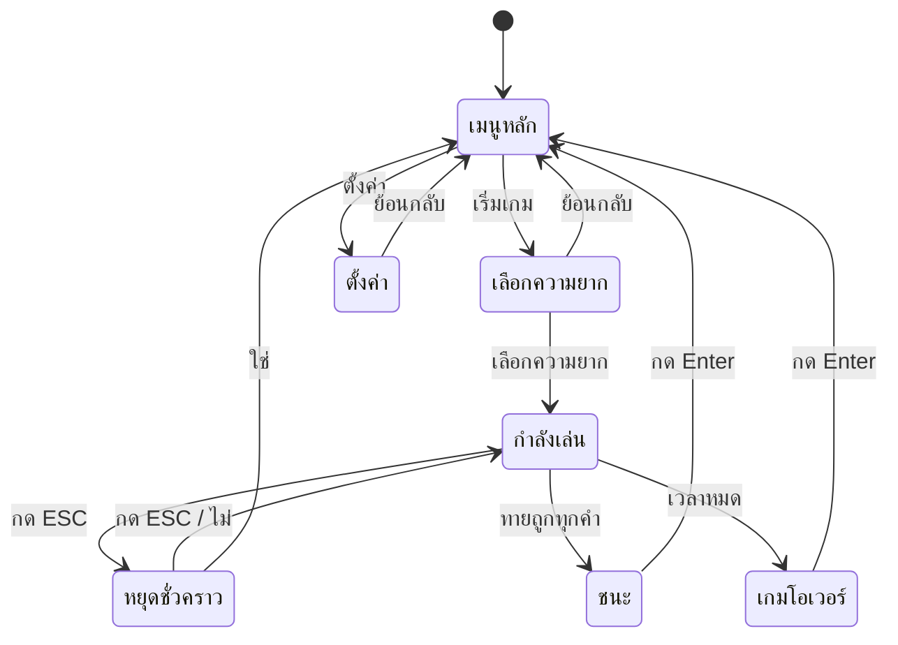
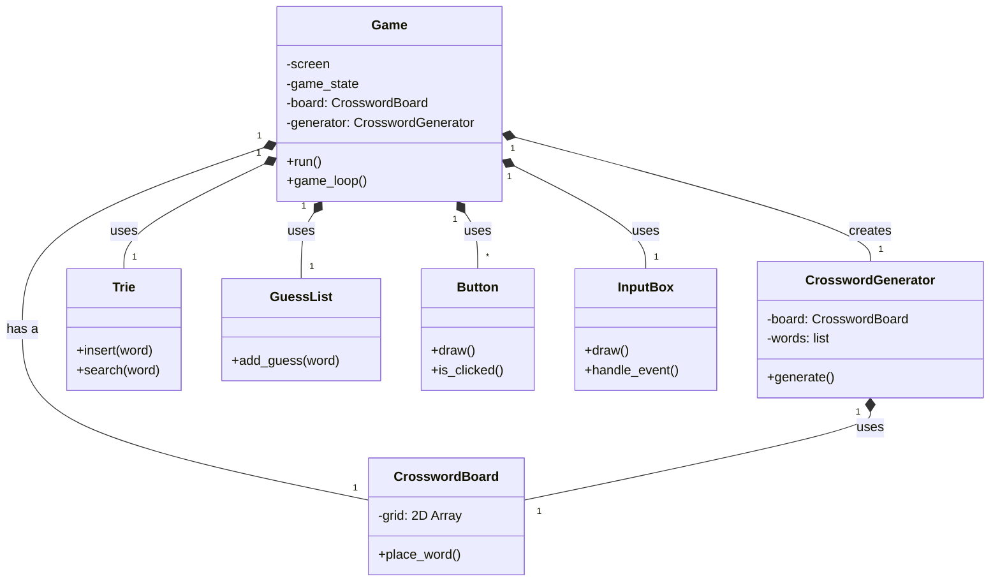
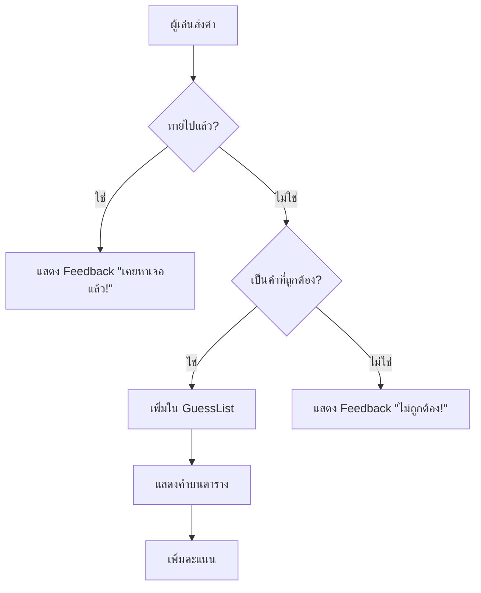

# CrosswordMe: เจาะลึกเบื้องหลัง

เอกสารนี้จัดทำขึ้นเพื่ออธิบายโครงสร้างและตรรกะการทำงานหลักของโปรเจกต์เกม CrosswordMe ซึ่งเป็นเกมปริศนาอักษรไขว้ที่สร้างขึ้นด้วยภาษา Python และไลบรารี Pygame

## Workflow ของโปรแกรม: State Machine

Workflow ทั้งหมดของเกมถูกควบคุมโดย State Machine ซึ่งจะคอยจัดการว่าในแต่ละขณะ ผู้เล่นจะมองเห็นและทำอะไรได้บ้าง แผนภาพนี้แสดงสถานะหลักๆ ของเกมและการเปลี่ยนผ่านระหว่างสถานะเหล่านั้น



ตรรกะของ State Machine ถูกนำมาใช้ในฟังก์ชัน `run()` ซึ่งเป็น Game Loop หลักของโปรแกรม

```python
# Game Loop หลักทำหน้าที่เป็น State Machine
def run(self):
    while True:
        if self.game_state == "main_menu":
            self.main_menu()
        elif self.game_state == "difficulty_select":
            self.options_menu() # แสดงปุ่มเลือกความยาก
        elif self.game_state == "options_screen":
            self.options_screen()
        elif self.game_state == "playing":
            self.game_loop()
        # ... และสถานะอื่นๆ
```

---

## ภาพรวมสถาปัตยกรรม (Class Diagram)

โปรแกรมถูกแบ่งออกเป็น Class ต่างๆ โดยแต่ละ Class มีหน้าที่รับผิดชอบชัดเจน แผนภาพนี้แสดงความสัมพันธ์และการทำงานร่วมกันของ Class หลักในโปรเจกต์



- **Game:** เป็น Class หลักที่ทำหน้าที่เป็น Game Engine ควบคุมทุกส่วนของเกม
- **CrosswordGenerator:** รับผิดชอบการสร้างตาราง Crossword ทั้งหมด
- **CrosswordBoard:** จัดการข้อมูลของตาราง Crossword ที่ผู้เล่นเห็น
- **Data Structures (`Trie`, `GuessList`):** Class ที่จัดการโครงสร้างข้อมูลโดยเฉพาะ
- **UI (`Button`, `InputBox`):** Class สำหรับส่วนประกอบที่นำกลับมาใช้ใหม่ได้ในหน้าจอ

---

## โครงสร้างข้อมูล (Data Structures) ที่ใช้ในโปรเจกต์

เกมนี้อาศัยโครงสร้างข้อมูลที่สำคัญ 3 ชนิดในการทำงาน

### 1. Trie (Prefix Tree)

Trie คือโครงสร้างข้อมูลประเภท Tree ที่ถูกออกแบบมาเพื่อจัดเก็บและค้นหาสายอักขระ (String) ได้อย่างรวดเร็ว โดยเฉพาะกับการค้นหาแบบ Prefix

**ทำไมถึงใช้ Trie?**
- **ประสิทธิภาพในการค้นหา:** ในเกม Crossword เราต้องตรวจสอบว่าคำที่ผู้เล่นพิมพ์เข้ามานั้นถูกต้องและมีอยู่ในเฉลยหรือไม่ การใช้ Trie ทำให้เราสามารถตรวจสอบคำศัพท์ได้อย่างรวดเร็วมาก โดยมีความซับซ้อนของเวลา (Time Complexity) อยู่ที่ **O(L)** โดยที่ L คือความยาวของคำศัพท์

**ตัวอย่างโค้ด:**
```python
class TrieNode:
    """โหนดแต่ละตัวในโครงสร้าง Trie"""
    def __init__(self):
        self.children = {} # เก็บโหนดลูก
        self.is_end_of_word = False # Flag บอกว่าเป็นตัวสุดท้ายของคำหรือไม่

class Trie:
    """Trie structure for storing words."""
    def __init__(self):
        self.root = TrieNode()

    def insert(self, word):
        """เพิ่มคำศัพท์เข้าไปใน Trie"""
        node = self.root
        for char in word:
            if char not in node.children:
                node.children[char] = TrieNode()
            node = node.children[char]
        node.is_end_of_word = True

    def search(self, word):
        """ค้นหาว่ามีคำศัพท์นั้นๆ อยู่ใน Trie หรือไม่"""
        node = self.root
        for char in word:
            if char not in node.children:
                return False
            node = node.children[char]
        return node.is_end_of_word
```

### 2. 2D Array (List of Lists)

เป็นโครงสร้างข้อมูลที่เรียบง่ายแต่ทรงพลังที่สุดในโปรเจกต์นี้ โดยใช้ List ซ้อน List ในภาษา Python เพื่อจำลองตาราง Crossword ขนาด 2 มิติขึ้นมา

**บทบาทในโปรเจกต์:**
- **`solution_grid`**: ใช้เก็บตาราง Crossword ที่สมบูรณ์ (เฉลย)
- **`board.grid`**: ใช้เก็บตารางที่ผู้เล่นเห็นและกำลังเล่นอยู่

**ตัวอย่างโค้ด:**
```python
# สร้างตารางขนาด size x size ด้วย List Comprehension
self.grid = [[' ' for _ in range(size)] for _ in range(size)]
```

### 3. Linked List (GuessList)

Linked List คือโครงสร้างข้อมูลที่ประกอบด้วยโหนด (Node) ที่เชื่อมต่อกันเป็นสาย

**บทบาทในโปรเจกต์:**
- **`GuessList`**: ถูกนำมาใช้เพื่อเก็บรายการคำศัพท์ที่ผู้เล่นทายถูกไปแล้ว
- **เหตุผลที่เลือกใช้:** เพื่อแสดงให้เห็นถึงความเข้าใจและการประยุกต์ใช้โครงสร้างข้อมูลพื้นฐานในการแก้ปัญหา

**ตัวอย่างโค้ด:**
```python
class GuessNode:
    """โหนดสำหรับเก็บข้อมูลคำศัพท์ที่ทายถูก"""
    def __init__(self, word):
        self.word = word
        self.next = None # ตัวชี้ไปยังโหนดถัดไป

class GuessList:
    """โครงสร้าง Linked List สำหรับเก็บ GuessNode"""
    def __init__(self):
        self.head = None # โหนดแรกของ List

    def add_guess(self, word):
        """เพิ่มคำศัพท์ใหม่เข้าไปที่ส่วนหัวของ List"""
        new_node = GuessNode(word)
        new_node.next = self.head
        self.head = new_node
    
    def display():
        """Prints all the guessed words."""
        current = self.head
        while current:
            print(current.word)
            current = current.next
```

---

## ส่วนประกอบของ UI (UI Components)

User Interface ของเกมถูกสร้างขึ้นจาก Class ส่วนประกอบที่สามารถนำกลับมาใช้ใหม่ได้ ทำให้การสร้างเมนูและหน้าจอต่างๆ มีความยืดหยุ่น

- **`Button` Class:** ใช้สร้างปุ่มที่สามารถคลิกได้ทั้งหมดในเกม เช่น ปุ่มในเมนูหลัก, ปุ่มเลือกความยาก, หรือปุ่ม Hint มีฟังก์ชันสำคัญคือ `draw()` สำหรับวาดปุ่ม และ `is_clicked()` สำหรับตรวจจับการคลิก

- **`InputBox` Class:** ใช้สร้างช่องรับข้อความที่ผู้เล่นใช้พิมพ์คำตอบ มีฟีเจอร์เสริมคือ Cursor กระพริบ และการเปลี่ยนสีเมื่อใส่คำตอบผิด (`trigger_error()`) ฟังก์ชันหลักคือ `handle_event()` เพื่อรับ Input จากคีย์บอร์ด และ `draw()` เพื่อวาดช่องข้อความ

---

## หัวใจของเกม: การสร้างปริศนา (Crossword Generation)

`CrosswordGenerator` คือ Class ที่รับผิดชอบในการสร้างปริศนาอักษรไขว้แบบ Dynamic ซึ่งเป็นหัวใจที่ทำให้เกมสามารถเล่นซ้ำได้เรื่อยๆ โดยมีขั้นตอนการทำงานหลักดังนี้:

1.  **เรียงลำดับคำ:** นำรายการคำศัพท์ที่สุ่มมาได้ มาเรียงตามความยาวจากมากไปน้อย
2.  **วางคำแรก:** นำคำที่ยาวที่สุดมาวางไว้ที่กึ่งกลางของตาราง เพื่อเป็นแกนหลัก
3.  **วนลูปหาจุดตัด:** วนลูปคำศัพท์ที่เหลือเพื่อหาตำแหน่งที่จะวาง
4.  **ค้นหาจุดตัด:** สำหรับแต่ละคำ จะค้นหาตัวอักษรบนตารางที่ตรงกับตัวอักษรในคำนั้นๆ เพื่อใช้เป็นจุดตัด
5.  **ตรวจสอบความถูกต้อง:** ณ ตำแหน่งที่เป็นไปได้ จะมีการเรียกใช้ฟังก์ชัน `_check_placement()` เพื่อตรวจสอบอย่างละเอียดว่าการวางนั้นถูกต้องตามกฎของ Crossword หรือไม่ (เช่น ต้องตั้งฉาก, ไม่วางติดกับคำอื่นในแนวขนาน)
6.  **สุ่มและวาง:** หากมีตำแหน่งที่ถูกต้องหลายตำแหน่ง จะทำการสุ่มเลือกมาหนึ่งตำแหน่งแล้ววางคำศัพท์ลงไป
7.  **ทำซ้ำ:** ทำซ้ำขั้นตอนที่ 3-6 ไปเรื่อยๆ จนกว่าจะไม่สามารถวางคำศัพท์ใดๆ ได้อีก

---

## ฟังก์ชันหลัก: การตรวจสอบคำ (Word Validation)

เมื่อผู้เล่นส่งคำตอบ จะมี Workflow ที่ชัดเจนในการตัดสินผลลัพธ์ เพื่อให้แน่ใจว่าผู้เล่นจะได้รับ Feedback ที่ถูกต้อง



ตรรกะในส่วนนี้ถูกจัดการภายใน `game_loop` หลักของเกม โดยมีการทำงานร่วมกันของ Data Structures ที่กล่าวมาข้างต้น คือใช้ `GuessList` เพื่อเช็คว่าเคยทายแล้วหรือยัง และใช้ `Trie` เพื่อเช็คว่าเป็นคำที่ถูกต้องหรือไม่
